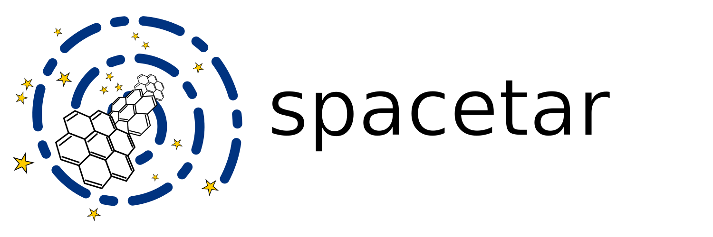

<div align="center">

# spacetar

<br/><br/>

<br/><br/>

![Tests][tests]
[![Coverage Status][coveralls-badge]][coveralls]
[![Uses Gitmoji][gitmoji-badge]][gitmoji]
[![Uses Black][black-badge]][black]
![MIT License][license-badge]
[![Docs Status][docs-badge]][docs]

## Space molecules 🧪 ⚗️ in your terminal 💻 !

</div>

<br/>

<div align="justify">

Outer space is cold 🥶 and vast. Since molecules often need to collide with one another with sufficient energy to form and react, scientists assumed that there could never be any molecules in space. Space was just too cold and too big for two molecules to ever encounter one another with enough energy. And then radio astronomers 📡 detected some of the first molecules in space. A realisation hit the astronomical community at large; whatever they thought they knew about chemistry in space was wrong. Thus began a completely new field: ✨ **astrochemistry** ✨. Since then, we have discovered all kinds of molecules in space: from smelly *ammonia* 🤢 to intoxicating *ethanol*, 🍻. To date, we know of more than *200 molecules* 🤯 that our telescopes have detected in space, and the number increases each year.

[**spacetar**][repo] brings them right into your terminal 💻.

Want to know when the *first molecule* was discovered in space 🥇 ? Or which telescope 🔭 has detected the *most number of molecules*? Or maybe you want to know where you can find the most *ethanol* 🍻 🍷 so that you know where to stock-up when we all get our warp drives 👾? All you have to do is open your terminal and start typing in ⌨️ your questions:

* The *first molecule* ?

    ```bash
    spacetar molecules
    ```

    ![Molecules Table][molecules-table]

    (*This displays the full table of molecules. The entries are arranged by year, so the first row is the first molecule discovered in space!* 😁)

* Which telescope has discovered the *most molecules* ?

    ```bash
    spacetar telescopes
    ```

    ![Telescope Table][telescopes-table]

    (*This displays the full table of telescopes that have detected molecules in space. The entries are arranged by the number of molecules detected, so the first row is the telescope that has discovered the most number of molecules!* 😁)

* Where is all the *ethanol* ?

    ```bash
    spacetar molecules --name ethanol
    ```

    ![Ethanol Summary][ethanol]

    (*This displays a pretty summary for ethanol. You can read out all the destinations you are going to hit in the **Detected in** entry. As you can see, **Sgr B2** is the place to be. This cloud has so much ethanol in it that we could use it to supply us with beers for millions of years!* 🍻)

    You can also get to know more about **Sgr B2** by typing:

    ```bash
    spacetar sources --name "Sgr B2"
    ```

    ![Sgr B2 Summary][Sgr-B2]

Excited 😁? Check out the [**docs**][docs] for more info on how to install and use spacetar, both from within Python and from the command line. If you find this project fun, star ⭐ the [**repo**][repo] on GitHub! You can also rave about spacetar, or bring up your ideas 💡 / feature requests, in the [**discussions**][discuss] or via [**email**][me-email]. You can also make an [**issue**][issues] if run into a bug 🐛.

[**spacetar**][repo], like everything else, stands on the *shoulders of giants*. It uses data compiled by [*Prof. Brett McGuire*][brett-github] for his paper 📝, the [*2018 Census of Interstellar, Circumstellar, Extragalactic, Protoplanetary Disk, and Exoplanetary Molecules*][census-paper]. You can find the database, along with some of the code that inspired [**spacetar**][repo] in the first place, in the associated [*GitHub repository*][census-repo]. Thank you Brett for the wonderful work 😄 ! If you end up using the database in [**spacetar**][repo] for something that might lead to a scientific publication, don't forget to cite the associated paper above 👍.

</div>

[gitmoji]: https://gitmoji.dev
[me-email]: ujjwalpanda97@gmail.com
[black]: https://github.com/psf/black
[docs]: https://spacetar.readthedocs.io
[me-github]: https://github.com/astrogewgaw
[brett-github]: https://github.com/bmcguir2
[me-twitter]: https://twitter.com/astrogewgaw
[repo]: https://github.com/astrogewgaw/spacetar
[census-paper]: https://doi.org/10.3847/1538-4365/aae5d2
[issues]: https://github.com/astrogewgaw/spacetar/issues
[interrogate]: https://interrogate.readthedocs.io/en/latest
[discuss]: https://github.com/astrogewgaw/spacetar/discussions
[census-repo]: https://github.com/bmcguir2/astromolecule_census
[coveralls]: https://coveralls.io/github/astrogewgaw/spacetar?branch=main
[docs-badge]: https://img.shields.io/readthedocs/spacetar?style=for-the-badge
[Sgr-B2]: https://raw.githubusercontent.com/astrogewgaw/spacetar/main/images/Sgr_B2.png
[ethanol]: https://raw.githubusercontent.com/astrogewgaw/spacetar/main/images/ethanol.png
[black-badge]: https://img.shields.io/badge/code%20style-black-000000.svg?style=for-the-badge
[gitmoji-badge]: https://img.shields.io/badge/gitmoji-%20😜%20😍-FFDD67.svg?style=for-the-badge
[license-badge]: https://img.shields.io/github/license/astrogewgaw/spacetar?style=for-the-badge
[tests]: https://img.shields.io/github/workflow/status/astrogewgaw/spacetar/tests?style=for-the-badge
[coveralls-badge]: https://img.shields.io/coveralls/github/astrogewgaw/spacetar/main?style=for-the-badge
[molecules-table]: https://raw.githubusercontent.com/astrogewgaw/spacetar/main/images/molecules_table.png
[telescopes-table]: https://raw.githubusercontent.com/astrogewgaw/spacetar/main/images/telescopes_table.png
[interrogate-badge]: https://raw.githubusercontent.com/astrogewgaw/spacetar/main/images/interrogate_badge.svg
